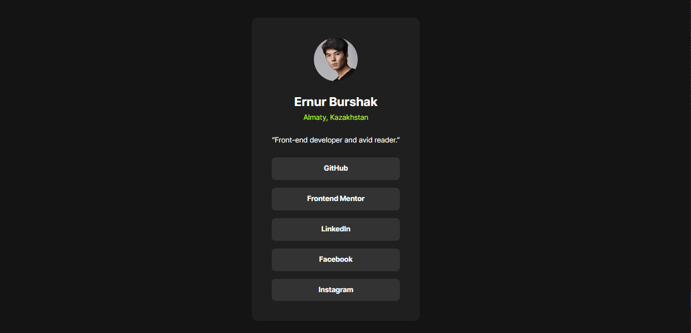

# Frontend Mentor - Social links profile solution

This is a solution to the [Social links profile challenge on Frontend Mentor](https://www.frontendmentor.io/challenges/social-links-profile-UG32l9m6dQ). Frontend Mentor challenges help you improve your coding skills by building realistic projects.

## Table of contents

- [Overview](#overview)
  - [The challenge](#the-challenge)
  - [Screenshot](#screenshot)
  - [Links](#links)
- [My process](#my-process)
  - [Built with](#built-with)
  - [What I learned](#what-i-learned)
  - [Continued development](#continued-development)
  - [Useful resources](#useful-resources)
- [Author](#author)
- [Acknowledgments](#acknowledgments)

## Overview

### The challenge

Users should be able to:

- See hover and focus states for all interactive elements on the page

### Screenshot



### Links

- Solution URL: [Add solution URL here](https://github.com/ernur-burshak/Social-links-profile)
- Live Site URL: [Add live site URL here](https://ernur-burshak.github.io/Social-links-profile/)

## My process

### Built with

- Semantic HTML5 markup
- CSS custom properties
- Flexbox
- Mobile-first workflow

### What I learned

```html
<q>Front-end developer and avid reader.</q>
```

```css
body {
  min-height: 100vh;
}
```

```css
ul {
  list-style-type: none;
}
```

```css
li {
  cursor: url("../assets/images/handcursor.svg"), pointer;
  transition: background-color 0.3s ease, color 0.3s ease;
}
```

```css
li:hover a {
  color: #333333;
}
```

```css
@media (min-width: 768px) and (max-width: 1024px) {
  .card {
    width: 384px;
    max-width: 456px;
  }
}
```

### Continued development

In the future, I want to expand my knowledge of css and make the most of css features.

### Useful resources

- [Frontend Mentor](https://www.frontendmentor.io/) - It always helps to improve Frontend skills.
- [Discord](https://www.frontendmentor.io/community) - This is the link for our Discord community for Frontend mentor.

## Author

- Website - [Ernur](https://ernur-burshak.github.io/Social-links-profile/)
- Frontend Mentor - [@ernur-burshak](https://www.frontendmentor.io/profile/ernur-burshak)

## Acknowledgments

I am always grateful to the Frontend Mentor platform for providing me with good practical work to improve my skills.
